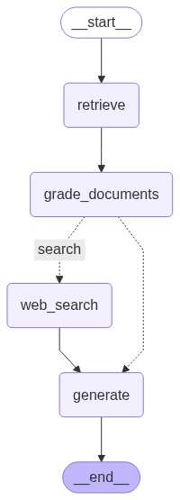

# EcoLens

**IBM Call for Code 2025 Submission**

🔗 [Live Demo](https://climate-change-silk.vercel.app)

---

## 📌 Overview

**EcoLens** is an AI-powered web application that helps users understand the environmental impact of their consumption habits — starting with something as simple as a chocolate bar.

Whether it’s carbon emissions, water usage, recyclability, or ethical sourcing, **EcoLens** zooms in on the lifecycle of products and services, giving users personalized and location-aware insights to make more sustainable choices.

---

## Features

-  **AI-Driven Product Impact Analysis**  
  Understand the carbon, water, and ethical footprint of your queries in seconds.

-  **Location-Aware Insights**  
  Use your latitude and longitude to tailor responses to your region or country.

-  **Agentic RAG Pipeline**  
  Multi-step retrieval-augmented generation using LangGraph and GPT.

-  **Trusted Sources**  
  Pulls from OpenLCA, Ecoinvent, IPCC, UNEP, and other climate databases.

-  **Structured Output**  
  Easily digestible JSON-based summaries with citations and actionable recommendations.

---

##  Tech Stack

| Layer        | Tools Used                                      |
|--------------|--------------------------------------------------|
| Frontend     | Next.js, Tailwind CSS, React                    |
| Backend      | LangGraph, IBM Watsonx.ai, Next.js api routing               |
| AI Models    | ibm/granite-13b-instruct-v2               |
| Retrieval    | FAISS, Tavily Web Search                        |
| Data Sources | Ecoinvent, OpenLCA, IPCC, OpenFoodFacts, UNEP   |
| Deployment   | Vercel                                          |

---

##  Architecture

EcoLens uses a **Hierarchical Agentic RAG System**:

1. **Query Decomposition**  
   Complex user prompts are broken down into sub-questions.

2. **CRAG Loop**  
   Each sub-question invokes a retrieval-grade-generate pipeline.

3. **Conditional Web Search**  
   Web search is only triggered if retrieved documents are insufficient.

4. **Consolidation**  
   All sub-answers are merged using a JSON-constrained final generation step.

5. **Location Integration**  
   Optional lat/long values personalize responses for regional relevance.

   ##  Diagrams

   ### CRAG Pipeline

   

   ### Nested CRAG Example

   

## Running Locally with Docker

To run the project locally using Docker, follow these steps:

1. **Ensure Docker is Installed**
   
   Make sure you have [Docker](https://www.docker.com/get-started) installed on your machine. You can verify the installation by running:
   ```sh
   docker --version
   ```

2. **Clone the Repository**
   
   If you haven't already, clone the repository:
   ```sh
   git clone https://github.com/BHK4321/climate-change.git
   cd climate-change
   ```

3. **Navigate to the Project Directory**
   
   Change to the `script` directory if applicable:
   ```sh
   cd script
   ```

4. **Build the Docker Image**
   
   Build the Docker image using the provided `Dockerfile`:
   ```sh
   docker build -t climate-change-app .
   ```

5. **Run the Docker Container**
   
   Start a container from the built image:
   ```sh
   docker run --rm -it climate-change-app
   ```

   - If you need to map ports or mount volumes, add the appropriate flags, for example:
     ```sh
     docker run --rm -it -p 8080:8080 -v $(pwd):/app climate-change-app
     ```

6. **Access the Application**
   
   - Follow any additional instructions printed by the container for accessing the application (such as URLs or credentials).
   - If the application exposes a web server, open your browser and go to [http://localhost:8080](http://localhost:8080) (replace with the correct port if different).

---

**Note:**  
Adjust the Docker commands as needed for your specific project setup. If there are environment variables, configuration files, or data directories required, ensure they are properly configured or mounted.

For troubleshooting or advanced options, refer to the [Docker documentation](https://docs.docker.com/).
