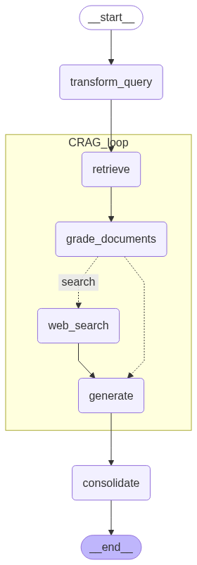

# EcoLens

**IBM Call for Code 2025 Submission**

🔗 [Live Demo](https://climate-change-silk.vercel.app)

---

## 📌 Overview

**EcoLens** is an AI-powered web application that helps users understand the environmental impact of their consumption habits — starting with something as simple as a chocolate bar.

Whether it’s carbon emissions, water usage, recyclability, or ethical sourcing, **EcoLens** zooms in on the lifecycle of products and services, giving users personalized and location-aware insights to make more sustainable choices.

---

## Features

-  **AI-Driven Product Impact Analysis**  
  Understand the carbon, water, and ethical footprint of your queries in seconds.

-  **Location-Aware Insights**  
  Use your latitude and longitude to tailor responses to your region or country.

-  **Agentic RAG Pipeline**  
  Multi-step retrieval-augmented generation using LangGraph and GPT.

-  **Trusted Sources**  
  Pulls from OpenLCA, Ecoinvent, IPCC, UNEP, and other climate databases.

-  **Structured Output**  
  Easily digestible JSON-based summaries with citations and actionable recommendations.

---

##  Tech Stack

| Layer        | Tools Used                                      |
|--------------|--------------------------------------------------|
| Frontend     | Next.js, Tailwind CSS, React                    |
| Backend      | LangGraph, IBM Watsonx.ai, Express              |
| AI Models    | meta-llama/llama-3-405b-instruct                |
| Retrieval    | FAISS, Tavily Web Search                        |
| Data Sources | Ecoinvent, OpenLCA, IPCC, OpenFoodFacts, UNEP   |
| Deployment   | Vercel                                          |

---

##  Architecture

EcoLens uses a **Hierarchical Agentic RAG System**:

1. **Query Decomposition**  
   Complex user prompts are broken down into sub-questions.

2. **CRAG Loop**  
   Each sub-question invokes a retrieval-grade-generate pipeline.

3. **Conditional Web Search**  
   Web search is only triggered if retrieved documents are insufficient.

4. **Consolidation**  
   All sub-answers are merged using a JSON-constrained final generation step.

5. **Location Integration**  
   Optional lat/long values personalize responses for regional relevance.

   ##  Diagrams

   ### CRAG Pipeline

   

   ### Nested CRAG Example

   

## Folder Structure

```plaintext
climate-change/
├── app/                 # Next.js routing and layouts
├── components/          # Reusable UI components
├── lib/                 # Utility functions and RAG logic
├── models/              # LangGraph state definitions
├── pages/               # Frontend pages
├── public/              # Static assets
├── scripts/             # Setup and initialization scripts
├── .env.local           # API keys and environment variables
├── package.json         # Dependencies and scripts
├── README.md            # This file
```

## Getting Started

### Prerequisites

- **Node.js** (v16 or higher)
- **npm** or **yarn**
- **Tavily Web Search Tool API Key**
- **IBM Watsonx.ai API Key** for enterprise-grade models

### Installation

Clone the repository and install dependencies:

```bash
git clone https://github.com/BHK4321/climate-change.git
cd climate-change
npm install
```

### Environment Variables

Create a .env.local file in the root directory and add:

```bash
TAVILY_API_KEY=your-tavily-api-key
IBM_API_KEY=your-ibm-api-key  
IBM_PROJECT_ID=your-ibm-project-id
```

### Running Locally

To start the development server:

```bash
npm run dev
```

Open your browser and go to:

```bash
http://localhost:3000
```
